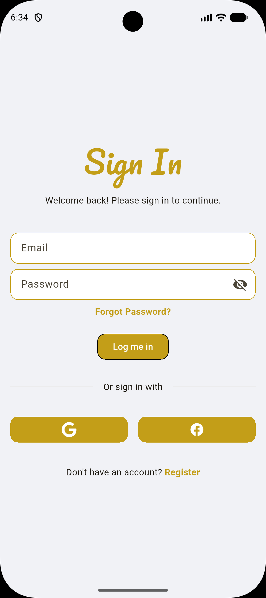
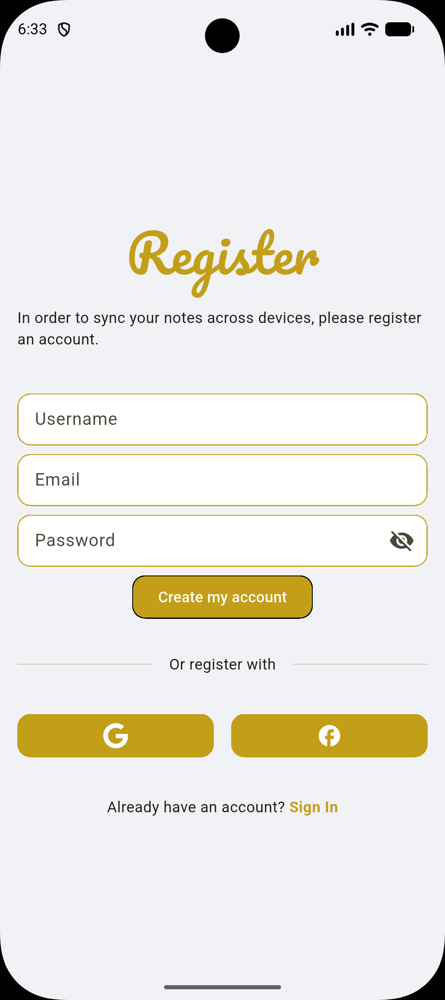
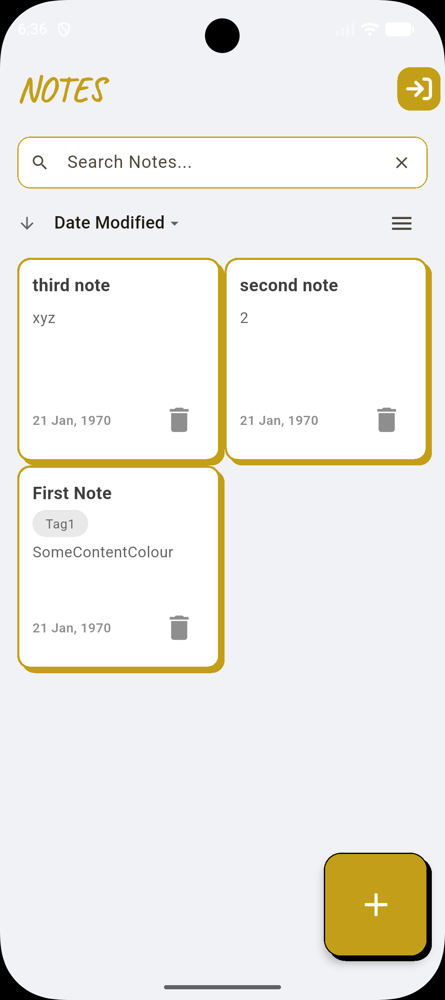
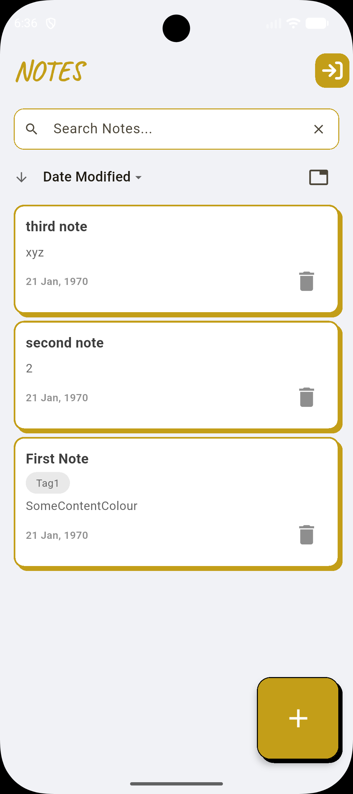
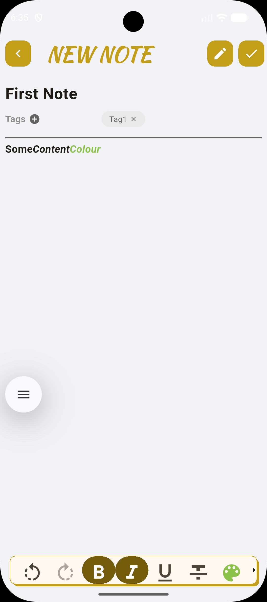
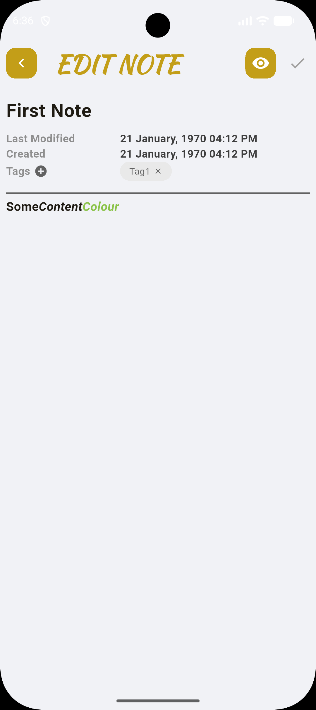
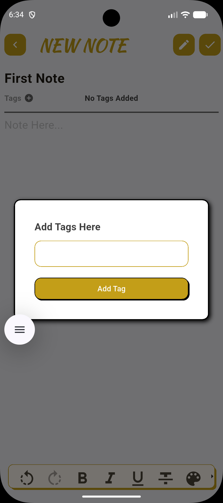
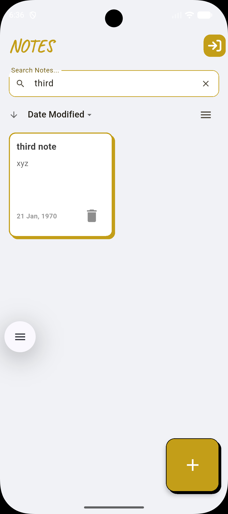

# 📝 Notes App (Flutter + Firebase)

A clean, modern **Flutter notes application** with authentication, tagging, rich-text editing, and cloud sync using **Firebase**.  
Built with real-world architecture and scalability in mind.

---

## ✨ Features Overview

### 🔐 Authentication
- Email & password **Sign In / Register**
- **Password recovery** via email
- Secure Firebase Authentication
- User-specific data isolation


| Sign In | Register | Recover Password |
|-------|----------|------------------|
|  |  |  |

---

### 🗒️ Notes Management
- Create, edit, view, and delete notes
- Auto timestamps (created & last modified)
- View-only and edit modes
- Grid & list layouts

| Notes List | Grid View | New Note |View / Edit Note |
|-----------|----------|----------|----------------|
|  |  |  |  |

---

### 🏷️ Tagging System
- Add custom tags to notes
- Remove tags individually
- Visual tag chips for quick context

| Add Tag Dialog |
|---------------|
|  |

---

### 🔍 Search & Sort
- Real-time note search
- Sort by **date modified**
- Clean empty & filtered states
  
| Search Notes |
|-------------|
|  |

---

## ✍️ Rich Text Editing
- Bold, italic, underline
- Text color support
- Undo / redo
- Minimal editor toolbar

---

## ☁️ Cloud Sync (Firebase)
- Notes stored securely in **Cloud Firestore**
- Per-user note collections
- Real-time updates
- Ready for multi-device sync

---

## 🛠️ Tech Stack
- **Flutter** (Material UI)
- **Dart**
- **Firebase Authentication**
- **Cloud Firestore**
- **Provider** (state management)
- **Flutter Quill** (rich text editor)

---

## 🔐 Security
- User data scoped by Firebase UID
- Firestore security rules enforced
- No sensitive keys committed
- Safe for public repositories

---

## 🚀 Getting Started

1. Clone the repository  
2. Create a Firebase project  
3. Enable:
   - Email/Password Authentication
   - Cloud Firestore  
4. Add your Firebase config files  
5. Run the app:
   ```bash
   flutter pub get
   flutter run
